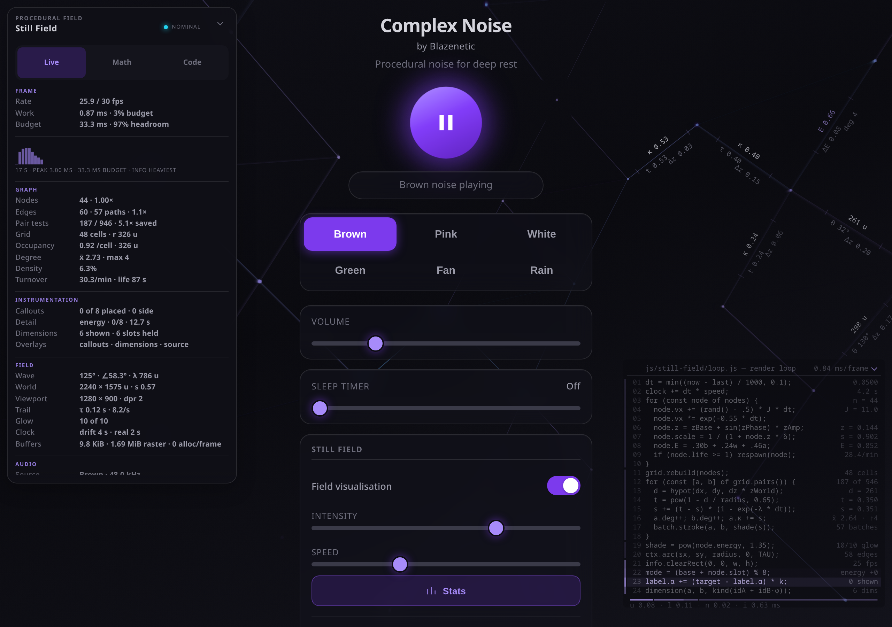

# Complex Noise

**Procedural noise for deep rest.**  
Free · Zero dependencies · Zero ads · Zero annual fee  
by **[Blazenetic](https://github.com/Blazenetic)**

[**→ Live demo**](https://blazenetic.github.io/complex-noise/)  
Add to Home Screen on Android for the full experience.



> It began because a commercial noise app decided ads on every pause and an annual fee were reasonable.  
> We disagreed.  
> Decision taken just before bed. Arty bootstrapped overnight. The rest of us worked furiously for the next two days.  
> 187 commits later we had a free app that actually works at 3 a.m.

Complex Noise is a pure client-side procedural generator (Brown, Pink, White, Green, Fan, Rain). No audio files, no repeating loops that click, no network after the first load. True continuous-feeling playback via the Web Audio API, built for long sleep sessions on phones — especially Android.

Built in a small Australian lab by **Blazenetic** (systems architect who researches the hard maths, deep-dives the literature, coordinates the team under firm direction, oversees the architecture, implements the elegant version when needed, then complains about the edge cases), **Arty** (the one who actually tests the sleep timer at 3 a.m. and looks up like someone is about to yell), and a supporting cast of increasingly questionable decision-makers.

**Documents**  
[Live demo](https://blazenetic.github.io/complex-noise/) · [Meet the Lab](docs/MEET_THE_LAB.md) · [History](docs/HISTORY.md) · [Teachings & Learnings](docs/TEACHINGS_AND_LEARNINGS.md) · [Blame](docs/BLAME.md) · [Changelog](CHANGELOG.md) · [Contributing](CONTRIBUTING.md) · [AGENTS.md](AGENTS.md) · [Info Layer](docs/INFO_LAYER.md) · [Still Field Architecture](docs/STILL_FIELD_ARCHITECTURE.md) · [All docs](docs/)

> **Melchett:** A mighty instrument in the war against sleeplessness! Six colours! Zero ticks! The bounce is dead! The clocks we control are the ones we trust!  
> **Darling:** It is a noise generator, Melchett.  
> **Blazenetic:** A *correct* noise generator. I researched the generators, coordinated the graph, oversaw the seam passes and the A-weighted matching, targeted the overnight failure modes, and then complained about the edge cases. You’re welcome.

---

## Quick Start

1. Open the **[live demo](https://blazenetic.github.io/complex-noise/)**.  
2. Tap the big purple play button. Choose **Brown** for sleep. Adjust volume. Optionally set a sleep timer.  
3. On Android, Add to Home Screen via the manifest for an app-like experience.

### Running it locally

The app is split into ES modules, which browsers fetch with CORS — so opening `index.html` directly from your filesystem will **not** work. Serve the folder over `http://` instead:

```bash
git clone https://github.com/Blazenetic/complex-noise.git
cd complex-noise
npm start                  # http://localhost:8123
# or, with no Node at all:
python3 -m http.server 8123
```

(If you do open the file directly, the page tells you so rather than sitting there silently. We are not monsters. Baldrick suggested we just `alert()` the user every five seconds until they serve it properly. That plan was rejected.)

---

## Features

This is the part where most READMEs list bullet points like a product manager wrote them. We are not most READMEs.

### The noise itself
- **Brown** (default) — deep, heavy, the colour you want when the brain needs to stop arguing with itself. Classic leaky-integrator Brownian motion.
- **Pink** — the middle ground. Present but polite.
- **White** — bright, full-spectrum, useful when you want the field to light up cyan and remind you that the universe is mostly static.
- **Green** — moderate-Q bandpass near 520 Hz. Stream / soft foliage character.
- **Fan** — pink through a gentle lowpass plus an extremely shallow whole-cycle LFO. Soft mechanical whir.
- **Rain** — continuous multi-layer (brown bed + brighter bandpass surface). No discrete drops. No thunder.

All of it is synthesised on the device. No samples. No loops that click. No network after the first load. The buffers are long enough that the seam is effectively inaudible for these stochastic signals; every generator now runs a seam pass so the wrap step sits inside its own adjacent-sample distribution. Continuous internal state inside each buffer means the generators do not restart from zero every twelve seconds like an amateur. Amplitude LFOs (where used) complete a whole number of cycles per buffer so there is no level jump at the loop point.

> **Arty:** I checked the spectral tilt, the A-weighted levels, the headroom and the wrap steps three times. Brown is actually brown. Green sits deliberately a little high because it is narrow-band. Please don’t yell.  
> **Blazenetic:** Good. Last time someone claimed “brown noise” and shipped pink with a low shelf I nearly left the industry. I research these things.

### Transport & comfort
- Volume with smooth ramps. Soft default of 0.22 so the first press does not wake the neighbours.
- Continuous sleep-timer slider (0–10 h, 0.5 h steps) with a gentle fade-out. Not a select box. A real slider. Because someone once said “select boxes are fine for sleep timers” and we refused to live in that world. Absolute wall-clock deadline so a suspended phone cannot overshoot by hours.
- Settings remembered in localStorage (with full Private Browsing throw guards, because Safari likes to punish the optimistic). Continuous controls are throttled so a slider drag does not hit the disk sixty times a second.
- Wake Lock support so the screen does not fall asleep while the noise is working — and the lock is released if playback has already stopped by the time the browser grants it.
- Colour switches are cancellable and coalesced: rapid clicks produce one buffer; pause → play cancels stale work so nothing tears down the newly resumed source at 3 a.m.

### Still Theme
Premium brushed-titanium dark (the default, because night is dark) plus a bone-white calm theme with a procedural SVG texture that actually moves a little. Theme is persisted. `theme-color` and `color-scheme` update live. It is not a toggle that forgets you exist.

### Still Field
The full-page nodes-and-edges visualisation that refuses to be a screensaver.

Nodes drift through a calm 3D volume with real perspective (pinhole camera, not a 3D engine). Each one makes a long, bounded near-to-far traverse, breathing toward you and receding without ever reaching a camera plane. They are born, they live 70–150 seconds, they fade. When a node dies its links retract into the surviving partners instead of vanishing like a bad animation. Quiet nodes keep a soft residual outline so they stay legible instead of dissolving into the background gradient.

Colour rides a violet → cyan ramp driven by three non-aligning energy layers (per-node breath + irrational plane wave + analyser). Brown keeps the field calm and violet. White pushes it toward electric cyan. The field is alive even when the audio is paused — silence still has breath and wave.

Default **on**. Intensity and speed controls (practical range 0.7–4.8). Battery-conscious 30 fps, stops completely when the page is hidden, respects `prefers-reduced-motion`.

> **Blazenetic:** I spent a non-trivial amount of research time finding the perspective and lifecycle maths that would let people fall asleep harder. I coordinated the architecture so the state modules own their state. You’re welcome.  
> **Baldrick:** My cunning plan was to make the nodes explode when they die.  
> **Darling:** No.

### Stats / Info Layer
Engineering-drawing callouts with leader lines, axis-coloured transform rows (X red, Y green, Z blue — the convention that actually makes sense), edge dimensions rotated onto the lines they measure, and a Live / Math / Code panel that shows real numbers, live equations with their operands evaluated, and per-stage timings.

Eight detail modes (energy, transform, velocity, projection, wave, links, lifecycle, seed) instead of five. The mode a given node shows is the global rotation offset by its own lifetime ID through the golden ratio — consecutive IDs land far apart, so the callouts on screen reliably read different quantities and each still walks the full set over a few dwells. Handle glyphs follow the family: circle for scalar, square for transform, diamond for phase, crosshair for vector.

Four kinds of edge dimension (span, coupling, reach, energy), stable for the life of the pair. Degree, coupling and nearest-neighbour distance are accumulated inside the existing link pass — no second graph scan.

The source overlay is now a heat trail that cools at 3.2/s rather than a full-width purple strobe. It folds from its own title bar. Three independent overlay chips in the Field Lab with a live “n of 3” readout.

On wide viewports the field itself carries a column of the renderer’s own source with a program counter whose dwell is the measured share of the frame. It is instrumentation, not decoration.

Callouts and edge dimensions have received a calm pass. Attack and release envelopes slowed and lengthened so cards stay readable and fade cleanly. Minimum hold raised. Edge slots increased to six with staggered secondary values on distinct lines. Nodes now remember their preferred side and only flip when that side is clearly unusable. The left/right bounce is gone. The continuous-time envelopes discretise exactly via `1 - Math.exp(-rate * dt)`, so the field remains identical at any frame cap. The sticky side is classical hysteresis applied to a placement contest.

Full contract: [docs/INFO_LAYER.md](docs/INFO_LAYER.md).

> **Blazenetic:** I researched the continuous-rate envelopes and the sticky-side hysteresis. I coordinated the capacity increase and the multi-line stagger. Then I complained about the left/right bounce and the sandbox that sulked at a hundred-and-twenty-five-kilobyte source file. You’re welcome.  
> **Arty:** Distinct modes. Independent toggles. Fold works. Sticky side. The bounce is dead. I checked three times. Please don’t yell.  
> **Baldrick:** Potato callouts that slowly cool and then fall off the screen? Potato counterweights on the leader lines?  
> **Darling:** No. And stop leaking process details. That was supposed to stay in the cabinet.

### Field Lab
The renderer’s own controls: node density, link reach, trail persistence, perspective strength, callout dwell, frame cap (30/45/60), and the three canvas overlays. All live. All persisted. Reset button included because sometimes you just want to go home again.

### Glass UI & Immersion
Translucent surfaces with backdrop blur so the living field shows through. An **ultra-transparent** mode that drops the panels almost to nothing when you want the field to be the entire world.

Dedicated **Minimise interface** button. When the chrome is gone a floating restore cluster appears (play + status + Show controls). Escape always brings everything back. The preference is persisted because some of us like to fall asleep looking at nodes, not menus.

### The rest of the polish
- Seamless mobile scrolling (scrollbars are hidden because they are ugly at 2 a.m.).
- Large touch targets. Real focus rings. ARIA labels. Accessibility is not a later problem.
- Clean inline SVG play/pause icons. Zero external assets.
- Refined vibrant purple play button that remains the clear focal point no matter what theme or glass mode you choose.
- Zero runtime dependencies. Zero network calls once loaded. MIT license. Made in Australia with the help of AI agents who were occasionally threatened with Baldrick’s potato plan.

> **Note on offline use:** nothing is fetched at runtime, so a loaded tab keeps working without a connection. True cold-start offline (airplane mode, app reopened from the Home Screen) needs a service worker. It is on the roadmap. We know. Arty has already written the issue title three times.

---

## Architecture (for developers & AI agents)

> Working on this codebase? Start with **[AGENTS.md](./AGENTS.md)**.  
> It covers how to run and test the app, the one architectural rule that keeps playback correct, and the traps that have already bitten people.  
> The Lab Voice is deliberately absent from that document. The sleep timer depends on it remaining so. Do not “improve” AGENTS.md with banter. Darling will notice.

Want to contribute? See **[CONTRIBUTING.md](./CONTRIBUTING.md)** — how to fork, report security issues, open PRs, and point your AI agent at the right place.

The codebase is intentionally modular so AI coding agents (and humans) can work on one concern at a time without navigating a single 40 kB file.

```
complex-noise/
├── index.html              # Markup only — links styles + entry module
├── css/
│   └── styles.css          # All Still Theme tokens + layout + glass UI
├── js/
│   ├── constants.js        # Durations, defaults, valid ranges, icon SVGs, storage keys
│   ├── storage.js          # Safe, typed localStorage access
│   ├── noise.js            # generateNoiseBuffer() — white / brown / pink / green / fan / rain
│   ├── audio.js            # AudioContext, EQ chain, play/stop, volume, timer, wake lock
│   ├── still-field.js      # Front door to the field renderer — public API only
│   ├── still-field/        # The renderer itself: 22 modules, one per concern
│   ├── theme.js            # Still Theme (dark ↔ bone) + glass mode + meta updates
│   ├── ui-chrome.js        # Immersion hide/show of the main controls
│   └── app.js              # DOM wiring, event listeners, boot sequence
├── tests/
│   └── run.mjs             # Browser smoke tests (Playwright)
├── manifest.json
├── AGENTS.md               # Contributor / agent guide (professional, zero banter)
├── CONTRIBUTING.md         # How to fork, report issues (incl. security), open PRs
├── README.md               # You are here. This one is allowed to be chaotic.
├── LICENSE
├── CHANGELOG.md            # What shipped + Lab Log
└── docs/                   # Historical requirements, visitor notes, Meet the Lab, History, Teachings, Blame
```

**State flows one way.** `audio.js`, `still-field.js`, `theme.js` and `ui-chrome.js` own state and publish it through `subscribe(fn)`. `app.js` is the only module that writes to the app’s DOM, and it does so exclusively in those subscription callbacks. Event handlers just call into the state modules.

This is not style preference. Playback stops on its own when the sleep timer fires hours later. Updating the play button inside its own click handler is precisely how it ends up frozen on “pause” over silent audio at 3 a.m. That bug has already happened. The test suite now guards against it. Learn from our pain.

**Audio graph**  
`AudioContext` → `AudioBufferSourceNode` (looping ~12 s procedural buffer) → Still EQ (3× BiquadFilterNode) → `AnalyserNode` → `GainNode` → destination

The analyser sits *before* the gain node on purpose. The visualisation tracks the noise, not the listening volume. Someone once put it after the gain and the field went dead whenever the volume was low. We do not speak of that afternoon.

**Noise generation**  
All noise is synthesised in `js/noise.js` → `generateNoiseBuffer(audioCtx, type, durationSec)`.
- White: pure uniform random
- Brown (Brownian / red): leaky integrator of white noise (classic noisehack formula)
- Pink: multi-pole IIR filter approximation (Paul Kellet refined method)
- Green: moderate-Q bandpass near 520 Hz
- Fan: pink + gentle lowpass + whole-cycle shallow LFO
- Rain: brown bed + brighter bandpass surface, continuous, no events

Buffers are long enough that the loop point is effectively inaudible. State (last sample / filter coefficients) is continuous *within* each buffer; a seam pass re-filters the head carrying the ending state so the wrap is continuous too. Amplitude LFOs (fan, rain) are derived from `lfoStep()` so they complete whole cycles per buffer.

**Still Field visualisation**  
Two full-viewport Canvas 2D layers behind the UI. No WebGL. No library. The depth is real perspective maths researched and applied carefully — not a 3D engine cosplaying as calm.

- **Depth.** Each node carries a `z` and projects through a pinhole camera, `scale = 1 / (1 + z · 0.75)`. Genuine parallax. Long, phase-separated bounded sinusoids carry every node through most of the volume without escaping overnight; restrained size and opacity falloff make the geometry readable on two-pixel points.
- **Linking.** 3D distance, not screen distance. Spatial grid with counting sort into pre-sized typed arrays. At 97 nodes the field visits ~440 pairs a frame instead of 4 656. Both numbers are visible in the Live view so the claim is checkable.
- **Lifecycle.** 70–150 s lives. R2 low-discrepancy spawn (Roberts, 2018). Retracting links. Residual outlines floored against dimness but scaled by the lifecycle envelope so births and deaths still ease.
- **Energy.** Three layers that never line up. Violet stays calm under brown; white pushes cyan.
- **Battery.** 30 fps default, motion integrated from real elapsed time, loop stops when the page is hidden, zero per-frame allocation, `shadowBlur` rationed. `prefers-reduced-motion` slows it and drops the glow.

See [Info Layer](./docs/INFO_LAYER.md) for the full instrumentation contract — including the eight modes, the φ offset, the heat trail and the fold.

**Glass surfaces**  
Transparency is a second axis alongside the theme (`data-glass="standard|ultra"`). Both combine freely with either theme. Text, the play button and the active noise type keep their contrast in all four combinations. Ultra is not a gimmick; it is for people who want the field to be the only thing left.

**Key extension points**
- `js/noise.js` → add a generator + a `data-type` button; `app.js` wires it automatically. New colours must match A-weighted loudness, leave headroom, and be periodic over the buffer (use the seam pass and `lfoStep()`).
- `css/styles.css` → CSS custom properties — rebrand colours and the Still Field palette in one place
- `js/audio.js` — insert additional nodes in `ensureAudio()`
- `js/still-field/` — the renderer, one module per concern; `js/still-field.js` is the front door and the public API. See [docs/STILL_FIELD_ARCHITECTURE.md](./docs/STILL_FIELD_ARCHITECTURE.md) for the map and the rules

See [AGENTS.md](./AGENTS.md#common-tasks) for the recipes. Do the recipes. Do not freestyle a second pair-scan in the render loop. Battery life is a feature.

**State (localStorage keys)**  
All keys are centralised in `js/constants.js` → `STORAGE_KEYS` and accessed only through `js/storage.js`. Never call `localStorage` directly. It throws in Safari Private Browsing. `parseFloat(x) || fallback` silently discards a stored volume of `0`. We have the scars.

---

## Tests

```bash
npm ci          # install the exact locked development dependencies
npm test        # headless browser suite, ~15s with the worker pool
npm test -- --headed
npm test -- --filter=colour
npm test -- --workers=1
npm test -- --repeat=20
npm run profile:still-field -- --filter=desktop-150-source
npm run profile:still-field -- --churn --dpr=2
```

`tests/run.mjs` drives a real Chromium against a real Web Audio graph and starts its own static server. It covers playback, the fade-out/restart race, the sleep timer (including simulated suspend), persistence (corrupt, zero, out-of-range), theming and glass, canvas transparency and battery stop, Info layer formats, graph metrics, keyboard navigation, spectral tilt of each noise colour, level matching, headroom, whole-cycle LFOs, rapid-switch races that count real buffers, wake-lock release on stop, throttled slider writes, and basic accessibility (labels + 44 px targets). Newer cases cover mode variety, independent overlay toggles, and the fold.

`tests/profile-still-field.mjs` is evidence rather than a CI benchmark. The
filtered command measures the steady source-overlay path; `--churn` separately
measures repeated fold/unfold and field stop/start interactions. Add
`PROFILE_ROOT=/path/to/control` for a matched worktree comparison.

Several tests exist because a plausible-looking refactor broke playback in a way that only shows up minutes later. The sleep-timer test in particular is the result of lived experience.

> **Arty:** I ran the full suite twice before this commit.  
> **Blazenetic:** Good.  
> **Arty:** …I ran it a third time. Just in case.

CI runs the suite and ESLint on every pull request (with a gate that correctly skips pure documentation changes without deadlocking the merge). If your environment ships a pre-provisioned Chromium, point the suite at it with `PLAYWRIGHT_CHROMIUM_PATH=...`.

---

## Contributing

Fork it. Experiment. Report issues (especially security). Open PRs for anything important.

Full guidance — including how we handle security reports and how to point your AI agent at the right document — lives in **[CONTRIBUTING.md](./CONTRIBUTING.md)**.

Short version:

1. Read [AGENTS.md](./AGENTS.md) first.
2. Run `npm test`.
3. Keep runtime dependencies at zero.
4. Do not put Lab Voice into agent-facing files.

---

## Roadmap

- **Service worker** for true cold-start offline / airplane-mode use. The app makes no network calls at runtime, but a first load still needs the network. We know this is the most requested missing piece.
- **AudioWorklet generation** — move the generators into an `AudioWorkletProcessor` for continuous, non-buffered synthesis and zero main-thread cost.
- **Stereo width** — independent left/right buffers via `ChannelMergerNode`.
- Optional nature layers mixed in as extra sources.
- Carefully measured things that are Baldrick’s fault (console greeting from the Lab, hidden Info-panel lines, the occasional Baldrick quote triggered by something suitably ridiculous). We will not apologise for these. Melchett has already declared them a strategic necessity.

> **Baldrick:** I have a cunning plan for the service worker. We just tell people to keep the tab open forever.  
> **Darling:** That is not a plan. That is a lifestyle.  
> **Blazenetic:** Write the service worker, Arty. Ignore him. I already researched the offline constraints.

---

## Browser support

Modern evergreen browsers (Chrome, Edge, Firefox, Safari) including Chrome for Android. ES modules are used; all current mobile browsers support them. AudioContext requires a user gesture — handled by the play button. `backdrop-filter` is widely supported; the UI remains fully usable without it.

If you are still on Internet Explorer we have nothing for you except quiet pity.

---

## Branding

Titanium dark surfaces + vibrant purple accents (Still Theme). Subtle silver-titanium Still Field. Glass panels that reveal the living field. Professional, calm, premium feel.

The product looks like it was designed by someone who cares about residual outlines having a floor. Because it was.

---

## License

MIT License

Copyright (c) 2026 Blazenetic

Do whatever you want with the code. Just don’t put ads on the pause button. We have already had that conversation with the universe and we won.

---

Made in a small Australian lab by Blazenetic, Arty, and a supporting cast of increasingly questionable decision-makers.  
See [Meet the Lab](docs/MEET_THE_LAB.md) for the cast list, [History](docs/HISTORY.md) for how we got here, [Teachings & Learnings](docs/TEACHINGS_AND_LEARNINGS.md) for the curriculum, and [Blame](docs/BLAME.md) for the affectionate ledger.  
See [Contributing](CONTRIBUTING.md) if you want to join the chaos productively.

**Blazenetic:** “I research the maths. I deep-dive the papers. I coordinate the architecture. I implement the elegant version. Then I complain about the edge cases. That is the job. The multiverse of identical callouts is slightly smaller today. Six colours. Zero ticks. Sticky sides. The bounce is dead. The clocks we control are the ones we trust. You’re welcome.”  
**Darling:** “And somehow the product still helps people sleep.”  
**Melchett:** “A crushing victory for the forces of rest!”  
**Baldrick:** “I still think the potato equaliser had merit—”  
**Darling:** “No. And stop leaking things that were supposed to stay in the cabinet.”

Research first. Architecture second. Potato plans last.  
The residual outlines still refuse to sink. You’re welcome.  
The software stays calm. The documentation gets to be chaotic. That is the deal.
