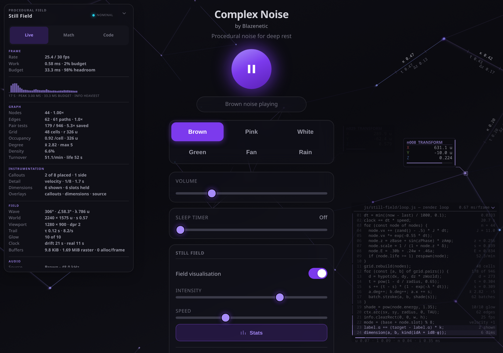
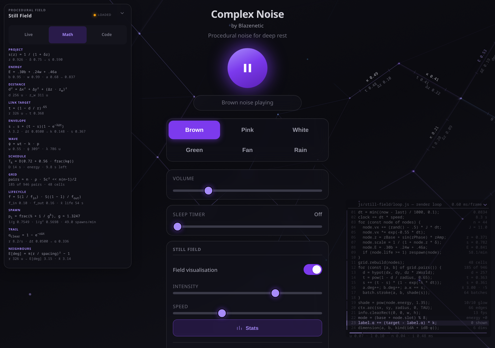
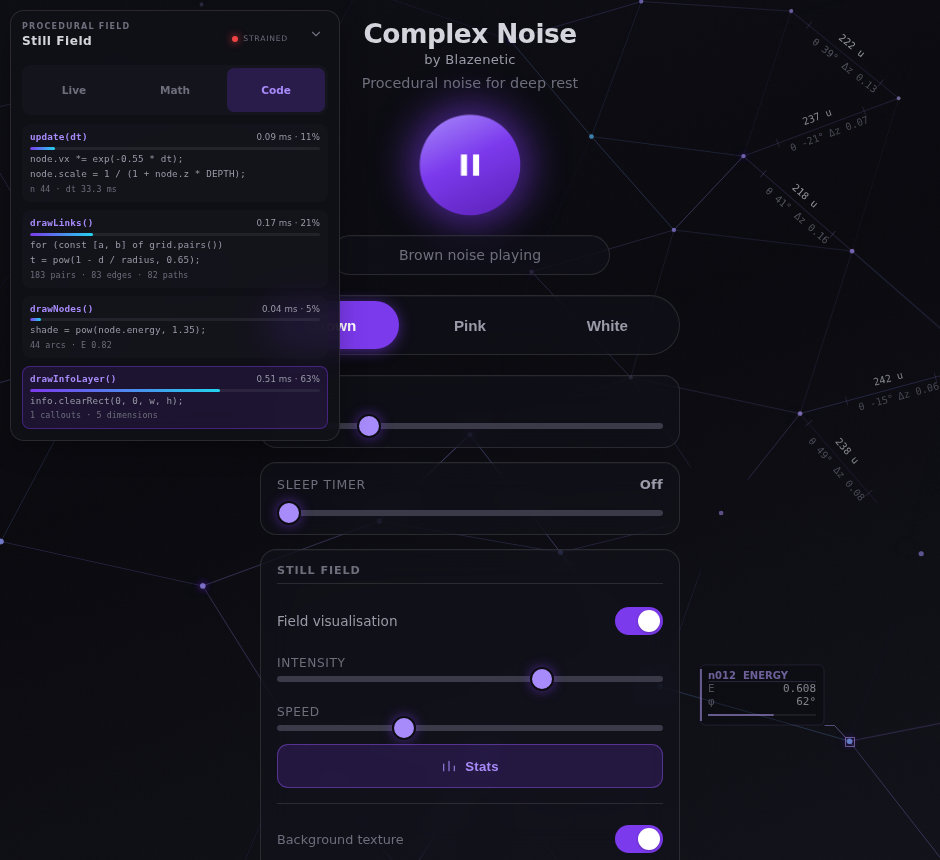
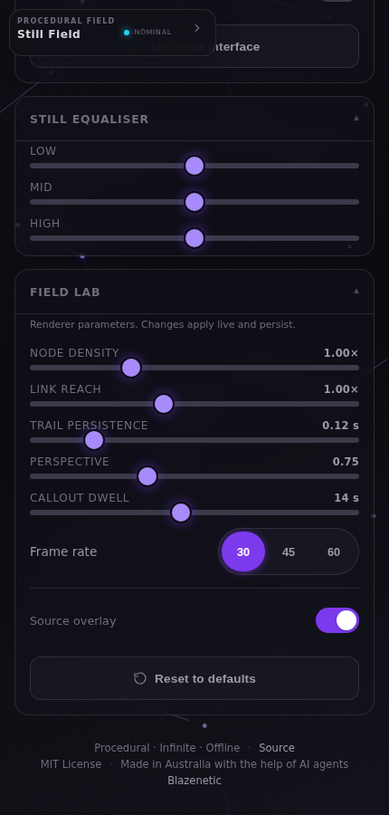

# Still Field Info Layer


**Navigation:** [Live demo](https://blazenetic.github.io/complex-noise/) · [History](./HISTORY.md) · [Meet the Lab](./MEET_THE_LAB.md) · [AGENTS.md](../AGENTS.md) · [Contributing](../CONTRIBUTING.md) · [All docs](./) · [Changelog](../CHANGELOG.md)

> **Lab aside:** This document is the technical contract for the instrumentation layer. It is allowed a small amount of personality at the edges, but the rules, numbers and constraints stay precise. Baldrick is not permitted to rewrite the pair-scan budget. The spatial grid already publishes its own pair-test counts in the Live view so anyone can verify the ~10× reduction.

The Stats control (card button + mobile launcher) governs one integrated
instrumentation layer: engineering-drawing callouts on the canvas, a source
listing that tracks the render loop, and the top-left Live / Math / Code panel.
It extends the sleep visualisation without introducing another renderer, graph
scan or DOM update loop.

## Two canvases, and why

`#stillField` keeps a trail: every frame subtracts alpha from the previous one
with `destination-out`. That is what gives the drift its comet tail — and it is
also what put a soft halo behind every callout, because a moving label leaves
half a second of decaying copies of itself smeared along its path. Text cannot
share a surface with a trail and stay crisp.

`#stillFieldInfo` is a second full-viewport canvas, later in the DOM (so it
paints above the field) and cleared outright every frame. Nothing drawn on it
ever sets `shadowBlur`, and every glyph origin is snapped to a whole device
pixel, so the type is as sharp as the display can draw it however fast it is
moving. The surface costs one `clearRect` per frame, and only while the layer is
on — when Stats is off it is cleared once and then left alone.

Legibility over a busy field comes from a **plate**, not a glow: a rounded,
mostly-opaque backing with a hairline border and an accent spine. A plate keeps
glyph edges intact; a halo is blur by definition.

## Controls

- **Still Field card** — distinctive Stats button (bar-chart icon + label).
  This is the master switch for the whole layer.
- **Mobile (≤520 px)** — top-left Stats launcher when the panel is off.
- **HUD fold** — chevron in the panel head collapses the body to a compact
  header (session-only; defaults folded on narrow viewports).
- **Canvas overlays** — a bank of three chips in the Field Lab, one per thing
  that gets painted over the field: **Callouts**, **Dimensions**, **Source**.
  They are separate settings because they cost different amounts and suit
  different moods; one switch for all three meant wanting quiet edges cost you
  the callouts too. The row carries a live `n of 3` readout.
- **Source overlay fold** — press the listing’s own title bar on the field. It
  collapses to a header bar carrying the file name, the line count and a
  chevron. The listing is canvas, so this is a hit test rather than a button
  (`handleOverlayPointer()`); the chip stays the keyboard-reachable, persisted
  control and the fold is session-only.
- **Field Lab** — the disclosure panel under the equaliser, covering node
  density, link reach, trail persistence, perspective, callout dwell, frame cap
  and the three overlays. See [the Field Lab section](#field-lab).

On/off is persisted (`complexNoise_stillFieldNerd`), as is each overlay
(`complexNoise_stillFieldCallouts`, `…Edges`, `…Code`). Both folds are
session-only.

## Node callouts

Every node receives a stable lifetime ID such as `n042`. Respawning creates a
new ID, so the callout identifies one procedural event rather than an array
slot.

A callout is an engineering annotation, not a floating caption:

- an **open handle** on the node itself, so it is obvious which of a dozen nodes
  the block belongs to. The glyph follows the detail mode — circle for a scalar,
  square for a transform, diamond for a phase, crosshair for a vector — so the
  family of quantity is legible before the text is;
- a **leader line** — one diagonal run out of the handle, then a short
  horizontal shelf into the block. Two straight runs read as a drawing
  annotation; a curve reads as a speech bubble;
- a **plate** with an accent spine, a head rule, and key/value rows;
- a **gauge** on the modes that have a naturally bounded quantity.

Rows are key/value pairs rather than one packed string. That is what lets the
position mode read like a 3D application's transform panel — axis letter in its
axis colour on the left (X red, Y green, Z blue, the convention Blender and most
CAD gizmos share), value right-aligned in a monospaced column with its unit —
instead of `xyz 124, -33, 0.42`, which asks the reader to count commas.



| Mode | Rows | Gauge | Handle |
|---|---|---|---|
| `energy` | `E`, `b`, `w`, `a` — the sum and its three layers | energy | circle |
| `transform` | `X`, `Y`, `Z` in axis colours | nearness | square |
| `velocity` | `\|v\|`, `θ`, `ω` | — | crosshair |
| `projection` | `scale`, `depth`, `near`, `px` | nearness | square |
| `wave` | `ψ`, `k·p`, `sin ψ` | local wave | diamond |
| `links` | `deg`, `κ`, `near`, `r` | degree / 8 | crosshair |
| `lifecycle` | `life`, `fade`, `τ`, `T` | lifecycle envelope | circle |
| `seed` | `i`, `u`, `v`, `z₀±` — its term of the R2 sequence | — | diamond |

### Every callout says something different

The rotation is global, but the mode a *given* node shows is that base index
offset by the node’s own `modeOffset`, derived from its lifetime ID through the
golden ratio:

```text
mode = (base + ⌊frac(id · φ) · M⌋) mod M
```

Consecutive IDs land far apart under φ, so eight callouts on a wide screen
reliably read eight different quantities, and each of them still walks the whole
set over a few dwells. One global mode meant every callout on screen was a copy
of its neighbour — a lot of pixels spent saying one thing. The Live view reports
how many distinct modes are actually placed, which is the honest measure of
whether the variety is working; `tests/run.mjs` asserts it.

The blocks are placed up and to the right of their node, mirroring left when the
right edge is close, and are rejected outright if they would land on another
block, on an edge dimension, on the source listing, or inside an interface
keep-out. Caps are 8 callouts on a wide viewport, 6 on a medium one and 4 on a
phone.

## Edge dimensions

Up to five established edges carry a dimension, drawn the way a length is
annotated on a technical drawing: the text **rides the line it measures**,
rotated to the edge's angle and flipped so it is never upside-down, with witness
ticks bounding the annotated span. Reading a length off a diagram works because
the number is parallel to the thing it describes; a horizontal caption floating
near a diagonal line makes the reader do the association themselves.

What a dimension measures depends on the pair, not on the slot. The kind falls
out of `frac(idA + idB · φ)`, so it is stable for as long as the pair exists — a
dimension never mutates into a different quantity while you are reading it — and
neighbouring edges reliably disagree.

| Kind | Above the line | Below the line |
|---|---|---|
| `span` | true 3-D distance `d u` | screen angle `θ`, depth separation `Δz` |
| `coupling` | envelope strength `κ` | link target `t`, `Δz` |
| `reach` | `d/r`, the fraction of the link radius used | radius `r`, `θ` |
| `energy` | mean endpoint energy `E`, in accent ink | `ΔE`, summed endpoint `deg` |

Every string comes out of a table indexed by the quantised measurement, so a
dimension that changes every frame still allocates nothing.

Samples are collected inside the existing link pass, which already has each
pair's distance and endpoints. There is no second graph scan, no sorting and no
edge list. The same pass accumulates each node's `degree`, `coupling` and
nearest-neighbour distance for the `links` callout mode — four increments and
two comparisons on numbers the renderer had already computed.

**A slot has to be able to draw.** A pair whose midpoint sits under the source
listing used to keep its slot for a full dwell while being unpaintable, and the
listing changes corner when the interface is minimised — so five slots held and
one dimension on screen was the *normal* state in immersion mode. Undrawable is
now treated as dead: the slot fades out and frees itself, and candidates that
are too short, off screen, or over the listing are rejected before they can
claim one.

## Timing is part of the simulation

Callouts used to vanish before you could read them. Three mechanisms fixed that,
and all three are procedural rather than a fixed interval.

**Quasi-periodic mode schedule.** Each of the eight detail modes holds for
`D · (0.72 + 0.56 · frac(kφ))` seconds, where `D` is the Field Lab's dwell
setting and `φ` is the golden ratio. The weights average 1, so `D` remains the
mean seconds per mode, but every mode gets a different, irrationally-related
slice. The rotation therefore never lines up with the travelling wave or with
node lifetimes, and the schedule falls out of the same mathematics as the field.

**Hysteresis and a guaranteed hold.** A node acquires a callout above energy
`0.42` and keeps it until energy falls below `0.32`, and once acquired the
callout is guaranteed `0.55 · D` seconds regardless. A node hovering on the
threshold cannot flicker.

**Opacity envelopes.** Selection drives a per-node alpha toward 1 at 2.6/s and
toward 0 at 0.85/s. Losing the placement contest fades a callout out over more
than a second instead of cutting it. Edge dimensions have the same treatment,
plus slot-level persistence: a slot follows one *pair* — identified by both
endpoints' lifetime IDs, because array indices are recycled — until the pair
breaks or its own dwell expires.

Envelopes run on the real clock, not the drift clock. How long a readout stays
legible is a property of the reader, not of the simulation's speed setting.

## The source overlay

On viewports at least 1000 px wide, the field carries a column of this
renderer’s own source with a program counter sweeping it. Each line is a real
statement from `js/still-field.js`, printed with the value it is currently
producing — `dt`, the node count, the grid cell count, the live `d`, `t` and `s`
of the link envelope, the edge and callout counts.

The counter is not decorative timing. Each stage’s share of the sweep is its
**measured** share of the frame’s work, sampled with `performance.now()` around
`update()`, `drawLinks()`, `drawNodes()` and `drawInfoLayer()`. The marker
lingers where the time actually goes; raise the node density and watch the link
pass take over the listing.

### Heat, not a highlight

The counter used to paint a full-width purple bar behind one line and jump it
every 70 ms. On a screen you are falling asleep to that is a strobe with a
monospace font on it.

Each line now carries a **heat** value. The counter sets the line it reaches to
1, every line cools at 3.2 per second, and the heat drives a very faint row wash
(peak alpha 0.085), a short caret in the gutter, and an accent over-print of the
glyphs at the heat's own alpha — so warmth *tints* the text rather than
switching its colour. The sweep itself slowed from 1.4 s to 2.8 s. What you see
is a soft comet moving down the listing. The decay is a rate per second like
every other decay here, so the tail is the same length at 30, 45 and 60 fps.

### Around the listing

- **Header** — the file name, the frame cost, and a chevron. Press it to fold.
- **Gutter rails** — one bar per contiguous run of lines belonging to a pipeline
  stage, its opacity that stage's measured share, so the shape of the frame is
  legible from the margin without reading a number.
- **Footer** — a stacked bar of the four stage shares and the raw milliseconds.

The listing picks a free corner from four candidates rather than sitting in a
fixed one — in immersion mode the floating play cluster owns the bottom right,
and a single fixed position would mean the overlay silently never appeared for
exactly the people most likely to want it. Whichever corner it takes becomes a
keep-out for callouts and dimensions; folded, that keep-out shrinks to the
header bar.

Toggle it with the **Source** chip in the Field Lab
(`complexNoise_stillFieldCode`). It follows the Stats toggle too — it is part of
the info layer.

## Live view

Grouped into five sections, because the reader is usually after one of five
questions and a flat list of twenty-five rows answers none of them quickly.

**Frame**

| Metric | Definition |
|---|---|
| Rate | Smoothed reciprocal of the accepted render timestep, against the cap |
| Work | Smoothed wall time for one `update()` + `draw()` cycle, as a share of the frame budget |
| Budget | Milliseconds the current cap allows, and the headroom left |

**Graph**

| Metric | Definition |
|---|---|
| Nodes | Node population and the density multiplier that produced it |
| Edges | Link envelopes strong enough to paint, the paths that carried them, and the batching ratio |
| Pair tests | Pairs the grid actually visited, against `n(n − 1)/2`, and the ratio saved |
| Grid | Live cell count and the link radius in world units |
| Occupancy | Nodes per cell and the cell size |
| Degree | Mean `2 · paintedEdges / nodes`, and the highest any single node reached |
| Density | `paintedEdges / n(n − 1)/2` |
| Turnover | Observed node births per minute, and the implied mean lifetime |

**Instrumentation**

| Metric | Definition |
|---|---|
| Callouts | Placed node callouts against the viewport cap |
| Detail | Base detail mode, distinct modes actually on screen, seconds left in the slice |
| Dimensions | Edge dimensions drawn, and slots currently held by a pair |
| Overlays | Which of the three canvas overlays are on, and whether the listing is folded |

**Field**

| Metric | Definition |
|---|---|
| Wave | Travelling-wave phase, vector angle and wavelength |
| World | World-plane size in units and the far-plane scale |
| Viewport | CSS pixels and the device pixel ratio the canvases are sized to |
| Trail | Tail time constant and the decay rate it came from |
| Glow | Nodes that reached the glow pass, against its hard cap |
| Clock | The speed-scaled drift clock and the real diagnostics clock |
| Buffers | Link-state bytes, and the renderer's per-frame allocation claim |

**Audio** — source and sample rate, drift multiplier and intensity, playback
uptime, then the analyser band meters and the smoothed field energy mirrored to
`--still-energy`.

Under the Frame group is a rolling **frame-time trace**: 68 samples at four a
second, so about seventeen seconds of history. It autoscales to the observed
peak rather than to the frame budget — fixed to the budget it was honest and
useless, because the renderer uses about 1% of a 33 ms frame and every bar
rounded to one pixel. The half-budget rule is still drawn whenever it falls
inside the range, so the absolute scale is never lost, and the caption carries
the peak in milliseconds. It is sampled on the readout’s own tick, never from
the render loop.

Health is **nominal**, **loaded** or **strained**. Renderer work leads and the
delivered frame rate only moderates it: a cap is honoured by *waiting*, so the
rate wobbles a frame either side of it on any machine, and reading that wobble
as strain while the renderer is using 1% of its budget is the readout disputing
its own measurements. It is feedback about the current browser and device, not a
benchmark score.

## Math view



Every row carries the symbolic form **and** the numbers the renderer is putting
through it this instant, evaluated against the highest-energy node on screen
(the "probe") and the first strong edge of the frame. A formula nobody can check
against live values is decoration; a formula with its operands beside it is
instrumentation.

```text
PROJECT     s(z) = 1 / (1 + δz)
            z 0.384 · δ 0.75 → s 0.776

ENERGY      E = .30b + .24w + .46a
            b 0.96 · w 0.97 · a 0.68 → 0.835

DISTANCE    d² = Δx² + Δy² + (Δz · z_w)²
LINK TARGET t = (1 − d / r)^.65
ENVELOPE    s ← s + (t − s)(1 − e^(−λΔt))
WAVE        ψ = ωt − k · p
SCHEDULE    T_k = D(0.72 + 0.56 · frac(kφ))
GRID        pairs ≈ n · ρ · 5c² << n(n−1)/2
LIFECYCLE   f = S(l / f_in) · S((1 − l) / f_out)
SPAWN       p_i = frac(½ + i / gᵏ), g ≈ 1.3247
TRAIL       α_clear = 1 − e^(−rΔt)
NEIGHBOURS  E[deg] = π(r / spacing)² − 1
DETAIL      m = (base + ⌊frac(idφ)·M⌋) mod M
```

`NEIGHBOURS` is worth a look: the link radius is *derived* from the mean spacing
so that a phone and a desktop both land near three connections per node, and the
row prints the expectation next to the measured mean. It is a check on the
derivation, not trivia.

The travelling-wave vector uses `WAVE_KY = WAVE_KX · φ`, giving an angle of
about `58.28°`. The irrational slope avoids a short visible repeat against the
low-discrepancy placement sequence.

## Code view



Four pipeline stages, each with its measured milliseconds and percentage, a
share bar, the statements it runs, and two lines of the values those statements
are producing. `data-hot` marks whichever stage currently dominates — the same
signal that paces the on-canvas program counter. A whole-frame total sits under
the four, against the budget the current cap allows.

## Field Lab



| Control | Range | Default | Effect |
|---|---|---|---|
| Node density | 0.5–2.2× | 1.0× | Multiplies the viewport-derived population (26–44) |
| Link reach | 0.6–1.6× | 1.0× | Multiplies the link radius |
| Trail persistence | 0.04–0.5 s | 0.12 s | Time constant of the trail’s alpha decay |
| Perspective | 0.3–1.6 | 0.75 | Depth strength; also re-derives the world plane |
| Callout dwell | 4–26 s | 14 s | Mean seconds per detail mode |
| Frame rate | 30 / 45 / 60 | 30 | Render cap |
| Callouts | on / off | on | Node callouts on the canvas |
| Dimensions | on / off | on | Edge dimensions on the canvas |
| Source | on / off | on | The on-canvas source listing |

The density default deserves a note: the multiplier applies to the *clamped*
26–44 window, not to the raw viewport area. Applying it to the raw figure would
have opened a 1440×900 display on 132 nodes at the default setting — a
different-looking field for everybody who never touches the Lab. Density is an
opt-in, not a silent redesign.

Motion is integrated from elapsed time, so the frame cap changes how smooth the
field looks and nothing about how fast it drifts. The trail is stored as a decay
*rate per second* for the same reason: a per-frame alpha would have quietly
halved every trail the moment the cap moved from 30 to 60.

Everything in the Lab is disabled while the field is off, and persisted under
`complexNoise_stillField*` keys.

## Performance

Linking is a **uniform spatial grid**, not an O(n²) scan. Cells are one link
radius across, and each node tests only its own cell and the four neighbours
that have not already tested it. Both the real and the would-be brute-force pair
counts are in the Live view, so the saving is visible rather than claimed —
typically 5× at the default population and above 10× with density raised.

The grid is rebuilt every frame with a counting sort into pre-sized typed
arrays: no maps, no arrays of arrays, no allocation. A node that wraps across
the world boundary clears its links, because a pair that stops being visited
would otherwise freeze its envelope at whatever strength it held.

Glow is rationed, and the ration is now walked rather than searched. `shadowBlur`
is the most expensive thing on this canvas, so only the few highest-energy nodes
get it; pass 0 records which nodes it deferred, and pass 1 iterates that queue
instead of the whole population a second time — ten iterations rather than a
hundred and fifty at the Lab's top density.

The readout paints only the view that is on screen, and nothing at all while the
panel is folded. Writing text into a hidden subtree still costs a style
recalculation, and there are three views' worth of it four times a second.

Consecutive edge segments that quantise to the same colour, alpha and width
accumulate into one path. Alpha varies almost continuously with depth and
strength, so this collapses runs rather than whole frames — a real saving when
the field is calm and a no-op when it is not. The path count sits next to the
edge count in the Code view so the ratio is visible.

## Accessibility contract

- Stop the loop outright while the page is hidden, whatever the frame cap.
- Collect graph counters and edge samples inside the existing link pass. Do not
  add a second pair scan, per-frame arrays, sorting or DOM writes.
- Refresh DOM instrumentation at 250 ms; refresh dynamic canvas strings at
  one-second cadence.
- Preserve reduced-motion behaviour (no glow pass, slowed drift, a program
  counter that sweeps at a third speed, no CSS transitions in the panel),
  transparent trail clearing, lifecycle fades and interface keep-outs.
- Keep Live / Math / Code as the only interactive elements in the panel body.
  Values are ordinary text, not `<output>` elements or live regions, so a screen
  reader is not interrupted four times a second.
- Every canvas affordance must have a real control behind it. The source
  listing's on-canvas fold is a convenience on top of the Field Lab chip, never
  the only way to reach the setting — a hit test on a canvas cannot be focused,
  labelled or reached from a keyboard.
- Tabs use the standard tab pattern with `aria-selected`, associated panels,
  roving focus and Left/Right Arrow navigation.
- Every Field Lab control is labelled, carries an `aria-valuetext` in words, and
  clears a 44 px touch target. `tests/run.mjs` audits both.
- Axis and ink colours are per-theme tokens, chosen to hold contrast against
  their own plate in dark and in bone.

---

See also the live technical orientation in [AGENTS.md](../AGENTS.md), the contribution guidelines in [CONTRIBUTING.md](../CONTRIBUTING.md), and the quantitative Lab Log in [CHANGELOG.md](../CHANGELOG.md).

> **Blazenetic:** I researched the spatial-grid literature, coordinated the typed-array implementation, and then complained about the residual outline floor. The Live view publishes the pair counts so you can check the claim yourself. You’re welcome.  
> **Baldrick:** My cunning plan was to make the pair-test ratio a potato.  
> **Darling:** No.

The software stays calm. The documentation is allowed a little chaos at the edges. That is still the deal.
